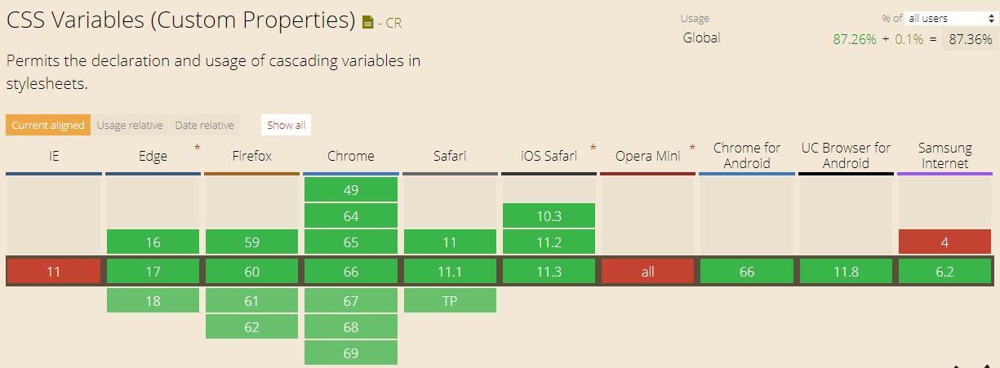
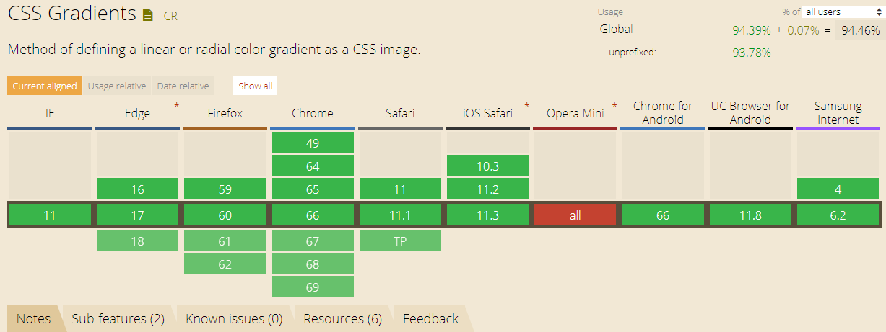
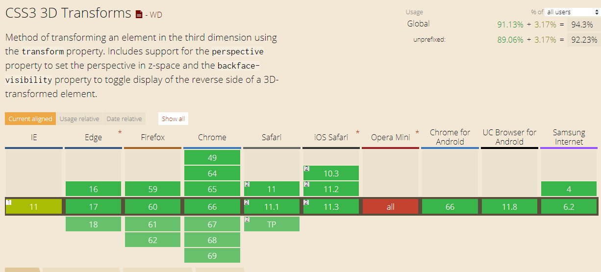
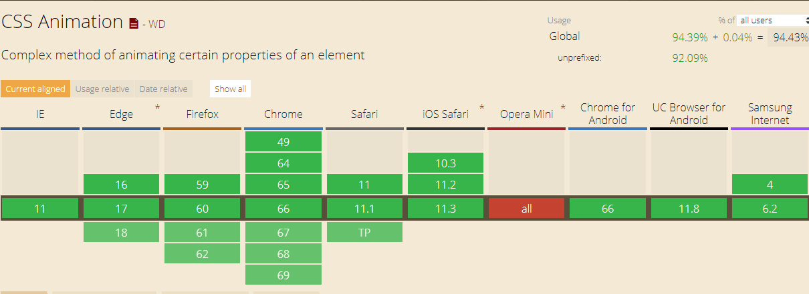
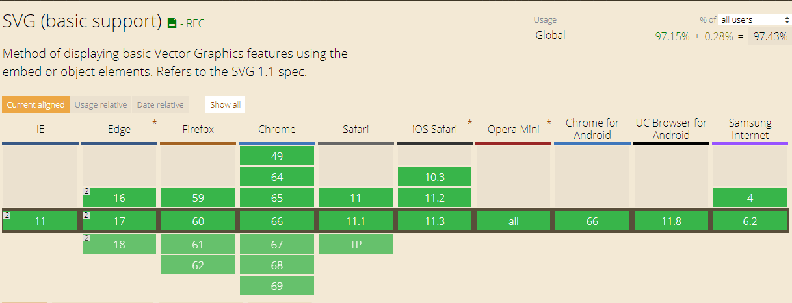
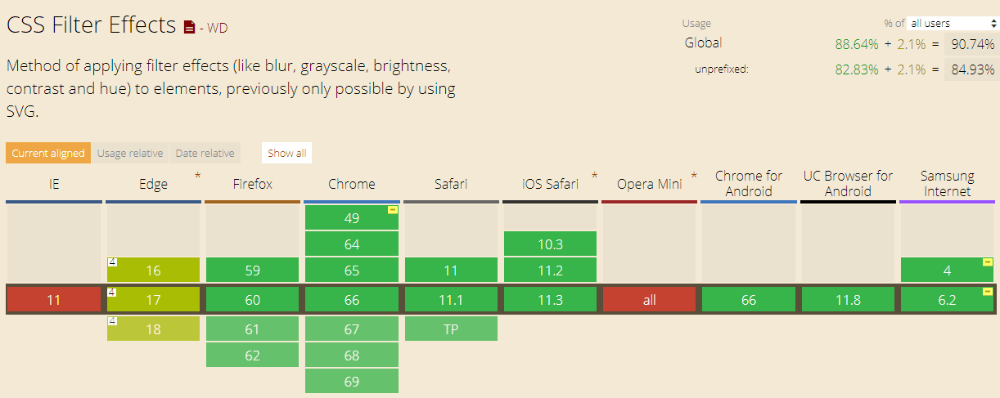

# CSS

## 1. CSS变量

### 什么是CSS变量

CSS custom properties(variables), 即CSS自定义属性，又叫CSS变量。

#### css变量有两种形式

> 变量，就是拥有合法标识符和合法的值。可以被使用在任意的地方。可以使用var()函数使用变量。例如：var(--example-variable)会返回--example-variable所对应的值

> 自定义属性。这些属性使用--*where*的特殊格式作为名字。例如--example-variable: 20px;即使一个css声明语句。意思是将20px赋值给--example-varibale变量

1. CSS变量兼容性



2. CSS变量使用

    1. 在选择器内使用
    2. 继承与重载
    3. js操作css变量
    
## 2. CSS渐变

1. CSS渐变兼容性



2. 线性渐变`background-image: linear-gradient(args);`
```
args = ([<angle> | to <side-or-corner>]? <color-stop> [, <color-stop>]+ )

渐变角度：<angle> = 0deg - 360deg
使用<side-or-corner> = <left [bottom | top]> | <right [bottom | top]> | top | bottom
<color-stop> = <color> [<percentage> | <length>]
``` 

3. 径向渐变`background-image: radial-gradient(args);`
```
args = ([ circle || <length> ] [ at <position> ]? ,
       | [ ellipse || [<length> | <percentage> ]{2}] [ at <position> ]? ,
       | [ [ circle | ellipse ] || <extent-keyword> ] [ at <position> ]? ,
       | at <position> ,
       <color-stop> [ , <color-stop> ]+) 

```

4. 结合CSS变量实现炫酷效果

## 3. CSS transform3D

### 简单介绍

1. CSS2D变换包括平移(translate)、旋转(rotate)、缩放(scale)，3D变换也一样：translate3d、rotate3d、scale3d
2. 也可以分开写: translateX、translateX、translateX， 旋转和缩放类似
3. 3D变换最重要的一个属性是perspective，他决定了3D变换的透视距离，有两种用法:
    - 作为属性在进行3d变换元素的父元素上使用：perspective: 300px
    - 直接在当前元素的transform上使用：transform: perspective(300px), rotateY(40deg)
### 使用
1. CSS transform3D兼容性


2. 用法

3. 结合CSS变量使用

## 4. CSS动画

### 简单介绍
CSS 动画属性可能大家都用过
### 使用
1. CSS animation兼容性


2. 用法

## 5. SVG
1. SVG兼容性


2. SVG介绍
    - svg内置图形
    - path介绍

3. SVG线条动画
```
stroke-dasharray
stroke-dashoffect
```

## 补充: CSS filter属性

1. CSS filter兼容性


2. filter各种属性介绍