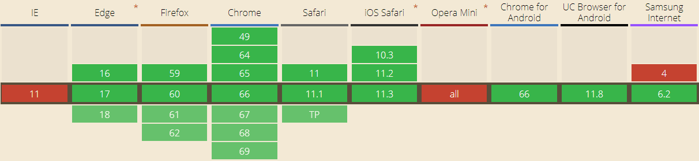

# CSS
## 1. CSS变量
### 什么是CSS变量

CSS custom properties(variables), 即CSS自定义属性，又叫CSS变量。

#### css变量有两种形式

1. 变量，就是拥有合法标识符和合法的值。可以被使用在任意的地方。可以使用var()函数使用变量。例如：var(--example-variable)会返回--example-variable所对应的值
2. 自定义属性。这些属性使用--*where*的特殊格式作为名字。例如--example-variable: 20px;即使一个css声明语句。意思是将20px赋值给--example-varibale变量
3. CSS变量兼容性

4. CSS变量使用
    1. 在选择器内使用
    2. 继承与重载
    3. js操作css变量
## 2. CSS形状
back-groundsize: 20px 30px;
background-image: radial-gradient(...);
background-image: linear-gradient(...);
## 3. CSS 3D
## 4. CSS动画
@keyframes
## 5. CSS+SVG动画
translate
## 补充: 强大的filter属性