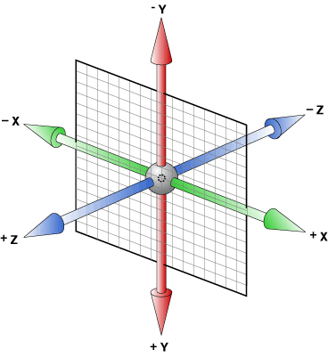

# CSS

## 1. CSS变量

### 什么是CSS变量

当前，CSS变量有两种描述，CSS自定义属性，又叫CSS变量。


> **CSS变量**: 拥有合法标识符和合法的值。可以被使用在任意的地方。可以使用var()函数使用变量。例如：var(--example-variable)会返回--example-variable所对应的值

> **CSS自定义属性**: 这些属性使用--*where*的特殊格式作为名字。例如--example-variable: 20px;即使一个css声明语句。意思是将20px赋值给--example-varibale变量

示例
```css
  div{
    /* 变量定义 */
    --width: 200px;
    /* 变量使用 */
    width: var(--width);
    height: calc(var(--width) / 2)
  }
```

### CSS变量兼容性


### CSS变量使用

使用`:root`来定义全局变量
```css
   :root {
     --bg-color: #f00;
   }
```
在特定元素下定义局部变量
```css
    div.myClass{
      --width: 100px;
    }
```

**媒体查询和伪类同样可以提供子作用域**

媒体查询中的变量
```css
    @media screen and (max-width: 400px){
      :root{
        --bg-color: #00f;
      }
    }
```
伪类下的变量
```css
    div:hover{
      --width: 120px;
    }
```
js操作css变量
```css
   /* css变量很大的一个好处就是它是动态的，我们可以随时通过js去改变变量的值，其他使用相应变量的属性也会同时改变 */
   /* 所以，利用css变量，我们可以很容易的实现许多页面效果 */
```
    
## 2. CSS渐变

### CSS渐变描述

### CSS渐变兼容性


### 渐变分类

css渐变共有两种，线性渐变和径向渐变

#### 线性渐变
`background-image: linear-gradient(args);`
```
args = ([<angle> | to <side-or-corner>]? <color-stop> [, <color-stop>]+ )

渐变角度：<angle> = 0deg - 360deg
<side-or-corner> = <left [bottom | top]> | <right [bottom | top]> | top | bottom
<color-stop> = <color> [<percentage> | <length>]
``` 
#### 线性渐变示例

```css
  div {
      background-image: linear-gradient(90deg, #f00 30%, #0f0 50%, #00f 90%);
  }
```

#### 径向渐变

`background-image: radial-gradient(args);`
```
args = ([ circle || <length> ] [ at <position> ]? ,
       | [ ellipse || [<length> | <percentage> ]{2}] [ at <position> ]? ,
       | [ [ circle | ellipse ] || <extent-keyword> ] [ at <position> ]? ,
       | at <position> ,
       <color-stop> [ , <color-stop> ]+) 

```
#### 径向渐变示例

```css
    div {
        background-image: radial-gradient(circle 10px, #00ff00, #0000ff);
    }
```

4. 结合CSS变量实现炫酷效果

## 3. CSS transform3D

### 简单介绍

#### 了解3D变换的坐标轴



2D变换的坐标轴是平面的，只有X，Y轴，对应于页面坐标系。 3D变换多了一个Z轴，朝向屏幕的方向为Z轴的正方向，如下图：

#### 3D变换的css属性

CSS3D变换和2D变换相似，也包括平移(translate3d)、旋转(rotate3d)、缩放(scale3d)三种操作

也可以分开写。比如，平移可以分别写为: translateX、translateX、translateX

##### **属性介绍：**

**perspective（透视）：** 3D变换最重要的一个属性，它决定了3D变换的透视距离，不设置则所有的，有两种用法:

    - 作为属性在进行3d变换元素的父元素上使用
    - 直接在当前元素的transform上使用

**transform：** 3d变换和2d变换的基础元素，在transform属性中使用变换方法，就可以对元素进行响应的变换操作。

**transform-orign：** 设置旋转的基点。默认的属性值为`transform-orign:50% 50% 0`，即相对于元素的中心点旋转(即left为元素的50%，top为元素的50%)。

**transform-style：** 规定3D变换元素的子元素是否应用3D变换，共有两个属性值。`flat`表示所有子元素应用2D变换；`preserve-3d`表示所有子元素应用3D变换

**perspective-origin（透视）：** 定义3D元素所基于的X轴和Y轴。即变换的中心点。

语法: `perspective-origin: x-axis y-axis;`

x-axis取值: `left | right | center | length | %`
y-axis取值: `top | bottom | center | length | %`

例:
```css
    div{
        perspective-origin: 50% 50%;
    }
```
    
#### CSS transform3D兼容性


#### 使用

##### 和父元素结合使用
```css
    .parent{
        perspective: 300px;
    }
    .parent div{
        transform: rotateY(40deg);
    }
```

##### 直接在当前元素使用
```css
    div{
        transform: perspective(300px) rotateY(40deg);
    }
```

##### 结合CSS变量使用

## 4. CSS动画

### 简单介绍
CSS 动画属性可能大家都用过
### 使用
1. CSS animation兼容性


2. 用法

## 5. SVG
1. SVG兼容性


2. SVG介绍
    - svg内置图形
    - path介绍

3. SVG线条动画
```
stroke-dasharray
stroke-dashoffect
```

## 补充: CSS filter属性

1. CSS filter兼容性


2. filter各种属性介绍